# live-merge

**Work in Progress!**

WebRTC 拉流合并转 RTMP 工具。

## 架构图

## TODOs

0. ✅ 从 SRS 拉取 WebRTC 音视频流;
1. ✅ RTP 拆包;
2. ✅ H264 解码为 YUV420;
3. 🔲 根据用户参数构造 ffmpeg 的 filter;
4. 🔲 音频合并;
5. 🔲 RTMP 推流;
6. 🔲 断流重试;
7. 🔲 提供 HTTP API;
8. 🔲 整理重构。

## 参考

[SFU: One to One](https://github.com/ossrs/srs/wiki/v4_CN_WebRTC#sfu-one-to-one)
[ffmpeg监听和接收rtp音视频流](https://blog.csdn.net/lixiaowei16/article/details/103956477)

## 问题

[与 SRS 的 DTLS 握手失败](https://github.com/ossrs/srs/issues/2931)
